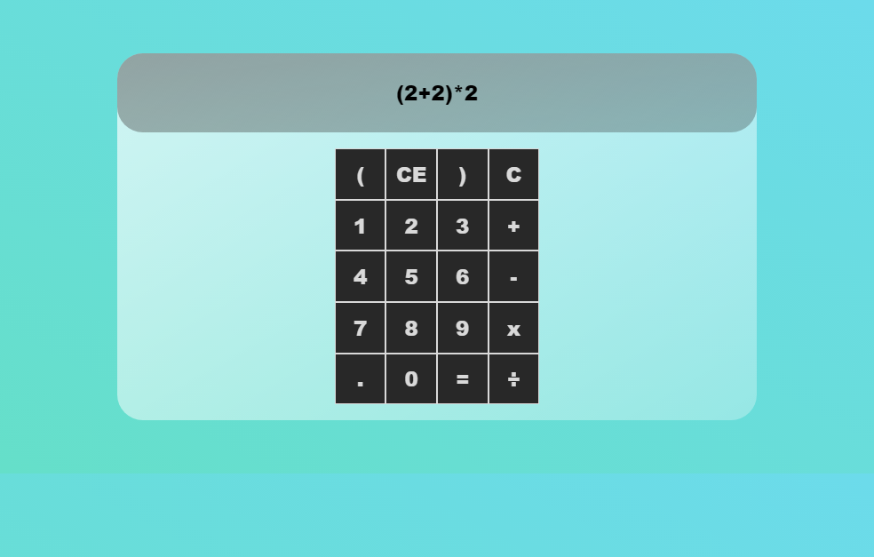

# Calculadorinha-react

	A simple react glass calculator.

<h4 align="center"> 
	🚧  Working  🚧
</h4>

 <a href="#Demonstration">Demonstration</a> •
 <a href="#how">How it works</a> •
 <a href="#Requirements">Requirements</a> •
 <a href="#usage">Usage</a> • 
 <a href="#technologies">Technologies Versions</a> • 
 <a href="#license">License</a>  

## Demonstration :desktop_computer:

<h1 align="center">
  
</h1>

### Features

- [x] Basic calculation
- [x] Animation
- [ ] Anwser the keyboard events

## Requirements

+ [Node](https://nodejs.org/)
+ [NPM](https://www.npmjs.com/)
+ [React](https://reactjs.org/)

## How it works

1. Clone the repository 
	`git clone https://github.com/Thiago-spart/Calculadorinha-react.git` 
2. npm install 
3. npm start
3. Done! 🚀

## Technologies Versions 🛠 

- HTML 5
- CSS 3
- React JS
- Node JS
- ECMA 6

## License 📜

[MIT](./LICENSE) 
